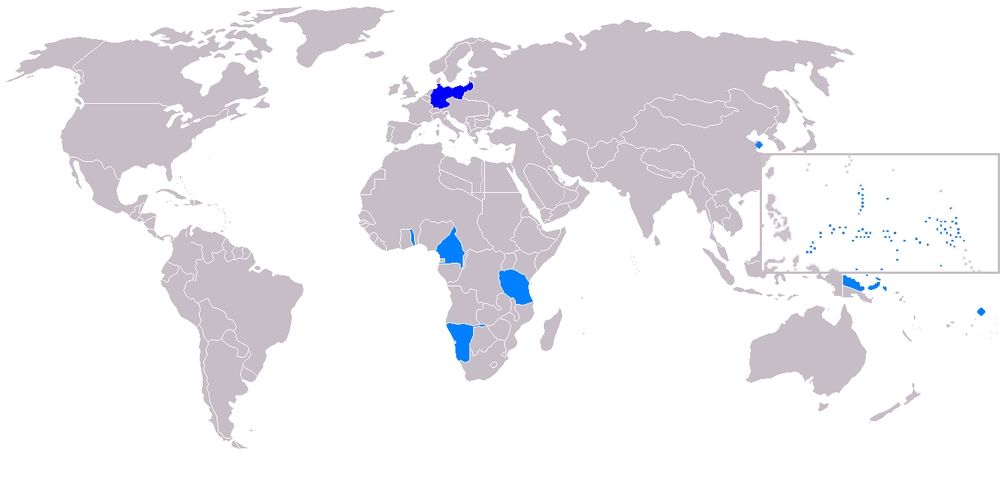

# 1 Einführung

Bevor es richtig losgeht: Warum machen wir hier eine Stadtführung zu Kolonialismus? Das hat zwei Gründe.

## 1.1 Bremen als koloniale Stadt in vier Phasen
Lorem ipsum dolor sit amet, consetetur sadipscing elitr, sed diam nonumy eirmod tempor invidunt ut labore et dolore magna aliquyam erat, sed diam voluptua. At vero eos et accusam et justo duo dolores et ea rebum. Stet clita kasd gubergren, no sea takimata sanctus est Lorem ipsum dolor sit amet. Lorem ipsum dolor sit amet, consetetur sadipscing elitr, sed diam nonumy eirmod tempor invidunt ut labore et dolore magna aliquyam erat, sed diam voluptua. At vero eos et accusam et justo duo dolores et ea rebum. Stet clita kasd gubergren, no sea takimata sanctus est Lorem ipsum dolor sit amet.

| event | description |
|---|---|
| 1500 bis 1885: Beteiligung und Profitierung Bremer Kaufleute an kolonialen Aktivitäten (v.a. Handel) anderer europäischer Kolonialmächte | Die europäische Expansion begann mit der sogenannt „Entdeckung Amerikas“ durch Christoph Kolumbus 1492, die den Ausgangspunkt für die Eroberung Amerikas durch europäische Mächte bildete. Im Gegensatz zu Großbrittanien, Frankreich, Spanien und Portugal hatten die deutschen Länder zwar keine eigenen Kolonien, beteiligten sich über eigene Handelsstationen in Afrika, Asien oder Amerika oder Handel mit Kolonialgüter aber rege an dem kolonialen Wirtschaftsnetzwerk. Bremer Kaufleute handelten mit Handelsstationen an der afrikanischen Küste, Bremer Reedereien führen nach Asien usw. |
| 1885-1919: Deutschland als Kolonialreich | Zwischen November 1885 und Februar 1885 trafen sich in Berlin die Staatsoberhäupter europäischer Staaten, um Ansprüche auf Gebiete in Afrika zu verhandeln. Deutschland erlangt dadurch erstmals Kolonien : Deutsch-Südwestafrika (1884-1915), Togoland (1884-1916), Kamerun (1884-1916), Deutsch-Ostafrika (1885-1918), mehrere Inseln und Inselgruppen im Pazifik (1885-ca. 1914)  werden deutsche Kolonien. In diesen Zeitraum fällt nicht nur der Anschluss Bremens an die deutsche Zollunion, sondern auch der (schon 1880 beschlossene) Neubau des Hafens in Bremen auf dem Gebiet der heutigen Überseestadt. |
| 1919-1945: starker Kolonialrevisionismus - politisches Engagement in Deutschland und besonders in Bremen für die Neuaneignung von Kolonien | Nachdem Deutschland im Verlauf des ersten Weltkrieges die faktische Kontrolle über seine Kolonien verloren hatte, musste es im Versailler Vertrag endgültig all seine kolonialen Gebietsansprüche an die Siegermächte (v.a. England und Frankreich) abtreten. In den folgenden Jahren entwickelte sich eine starke Bewegung, die dies nicht hinnehmen wollte und sich für die erneute Aneignung von Kolonien einsetze. Diese Stimmen waren in Bremen besonders stark vertreten und fand seinen symbolischen Höhepunkt mit der Ernennung Bremens zur „Stadt der Kolonien“ durch die nationalsozialistische Führung. |
| seit 1945: Auswirkungen kolonialer Machtverhältnisse bis heute (Handelsbeziehungen, Handelspolitik, Stadtpolitik, Erinnerungspolitik) | Seit 1945 sind Forderungen nach einer Neuaneignung von Kolonien in Deutschland sehr selten geworden und politisch nicht durchsetzbar, die meisten Kolonien wurden zudem zwischen den frühen 1950er und 1970er Jahren politisch unabhängig. Nichtdestotrotz sind die globalen Handelsbeziehungen, in die auch Bremen eingebunden ist, nach wie vor von Ungerechtigkeit und ungleichen Möglichkeiten geprägt, von denen Europa im allgemeinen und Bremen im Speziellen profitiert. Gleichzeitig wird über Deutschlands koloniale Vergangenheit und die daraus erwachsene Verantwortung kaum gesprochen. |

### To-Do (Janne?)

  - [] final timeline will be image/svg instead and replace table

## 1.2 Hafen als Ausdruck des kolonialen Verhältnisses

Lorem ipsum dolor sit amet, consetetur sadipscing elitr, sed diam nonumy eirmod tempor invidunt ut labore et dolore magna aliquyam erat, sed diam voluptua. At vero eos et accusam et justo duo dolores et ea rebum. Stet clita kasd gubergren, no sea takimata sanctus est Lorem ipsum dolor sit amet. Lorem ipsum dolor sit amet, consetetur sadipscing elitr, sed diam nonumy eirmod tempor invidunt ut labore et dolore magna aliquyam erat, sed diam voluptua. At vero eos et accusam et justo duo dolores et ea rebum. Stet clita kasd gubergren, no sea takimata sanctus est Lorem ipsum dolor sit amet.

## 1.3 Abschluss
Augensymbol: Auf dem Weg darauf achten, was was mit Kaffee zu tun hat
